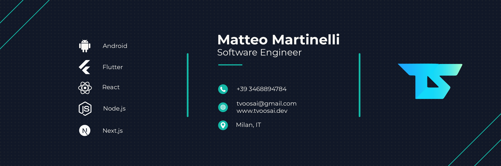

# Tvoosai – Developer Portfolio

Welcome to my personal portfolio, crafted with modern technologies and focused on performance, accessibility, and multilingual experience.

🌐 **Live site**: [https://tvoosai.dev](https://tvoosai.dev)

---

## 🚀 Tech Stack

- **Framework**: [Next.js](https://nextjs.org/) (App Router)
- **Styling**: Tailwind CSS + DaisyUI
- **Multilingual**: next-intl (Italian, English, German)
- **SEO**: Dynamic metadata, OpenGraph, Twitter Cards, canonical & hreflang tags
- **Accessibility**: Focus on keyboard navigation and screen reader support
- **Hosting**: Vercel

---

## 🌍 Features

- 🔄 Locale-aware routing (`/it`, `/en`, `/de`)
- 🎨 Automatic theme adaptation (light/dark mode based on system)
- ⚡ Fully responsive UI
- 🧭 Scroll-synced section highlighting
- 🔎 Sitemap and robots.txt with dynamic last modified date
- 📄 SEO-optimized metadata per section and per language
- 🧠 Semantic HTML and accessibility-friendly markup

---

## 📸 Preview

---

## 📫 Contact

Feel free to reach out for freelance opportunities or collaboration:

- [LinkedIn](https://www.linkedin.com/in/tvoosai)
- [Email](mailto:hello@tvoosai.dev)

---

> Built and maintained by Matteo (Tvoosai) 💻
>
> Proudly designed to be fast, accessible, and developer-focused.

---

© Tvoosai. All rights reserved.

